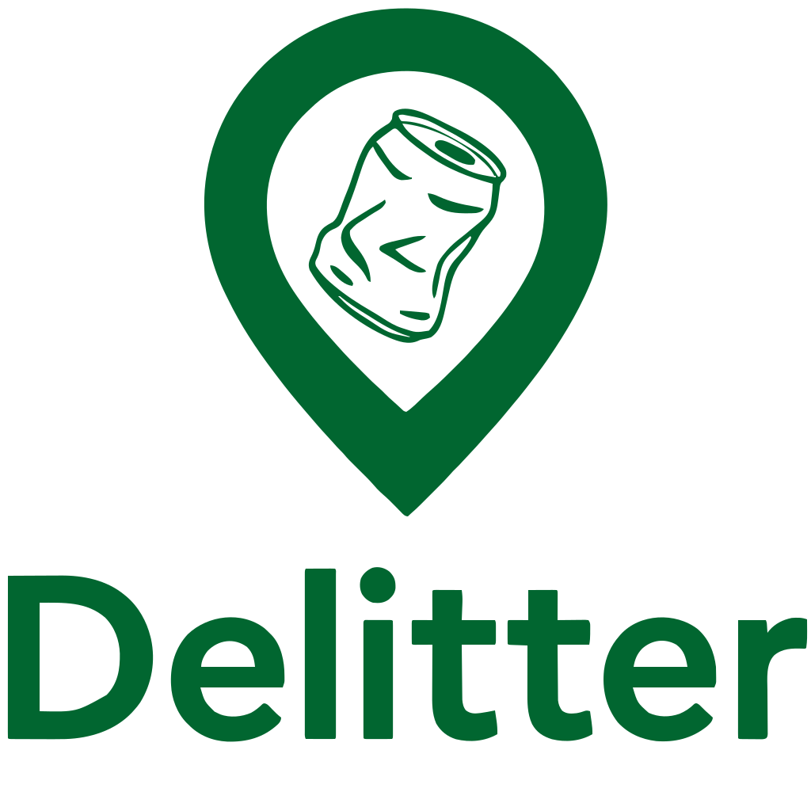
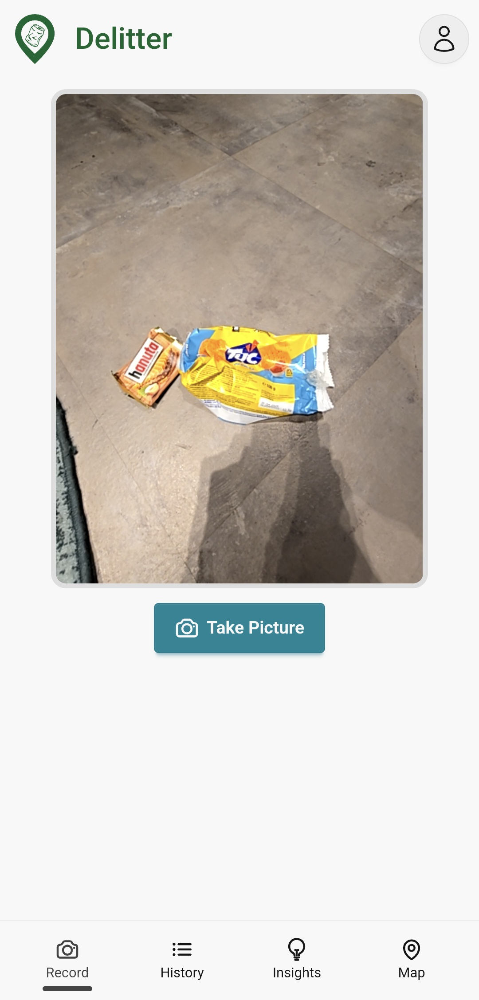
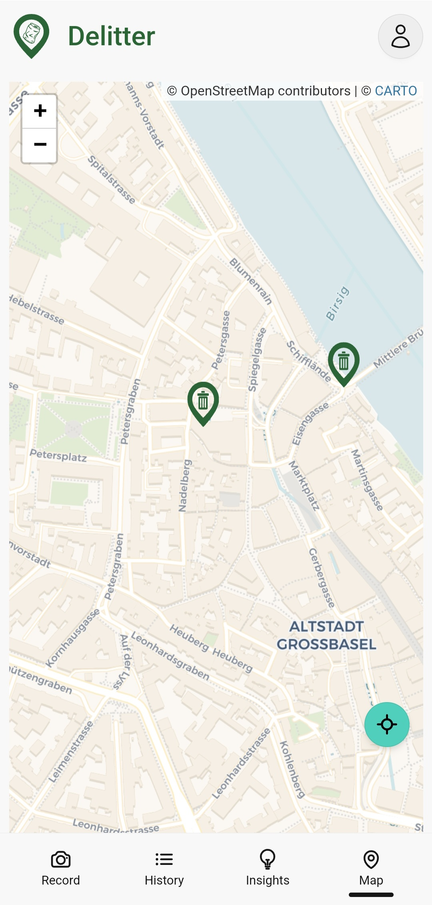
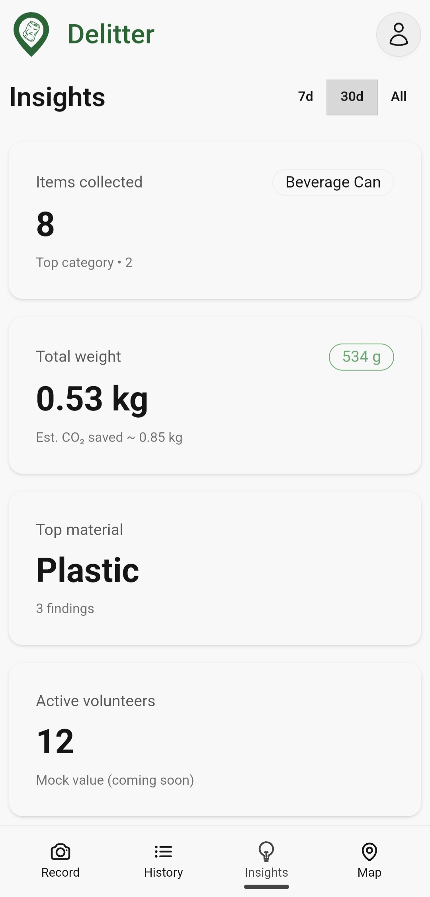

  

 
Delitter helps you capture, analyze and visualize litter you find in the environment and show the impact of your cleanups.

## Our mission
We believe that every small cleanup effort matters.
Our mission is to make the littering problem visible and measurable by supporting the reporting of local cleanup actions by groups like the boy scouts and mapping their impact.

## Quick overview
- Report litter by taking pictures.
- Get AI-powered image analysis that detects litter items, categories, materials, the brand and estimated weight.
- View collected reports on an interactive map and in a data dashboard.
- Sign up / sign in to save your cleanups and report about your impact.

## Screenshots

  
  
  

## How to use the app
- Go on a run or take a stroll through your neighborhood, and make sure you bring a trashbag and your fully charged phone
- Every time you pick up a piece of trash, open the app, the camera opens automatically so you can take a picture
- Once your bag is full and you're at home again, open the app to review your pickups on the map
- Use the History view to browse all past pickups and track your progress over time

## Want to contribute?
All documentation for local install and deployment is available in the README files inside each subfolder of the repository